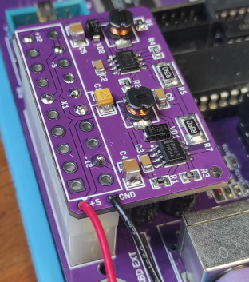

ATXMod для Sprinter-а
=====================

Модуль питается от +5В и вырабатывает напряжения +12В, -12В и опционально -5В.

Предназначен для установки на место разъема ATX, или на ответную часть разъема, для питания любительского персонального компьютера [Sprinter](https://sprinter.ru/).

Модуль можно использовать и в других аналогичных конструкциях, например, для питания новодельных копьютеров Орион-ПРО и Радио-86РК, с разъемами ATX.

Выходной ток по каналам +-12В, до 0,9А. Его можно изменить, путем перерасчета резисторов R5 и R7. Так, при сопротивлении R5=R7=0,27 Ом, пиковый ток будет около 1,1А.
Выходной ток по -5V ограничивается используемым регулятором и его площадью охлаждения и превышает 280мА.

[Исходники](Sources)

[Готовые схемы](Export)

[Герберы](Gerber)

В настоящий момент, платы модуля заказаны, модуль в работе не проверен.
